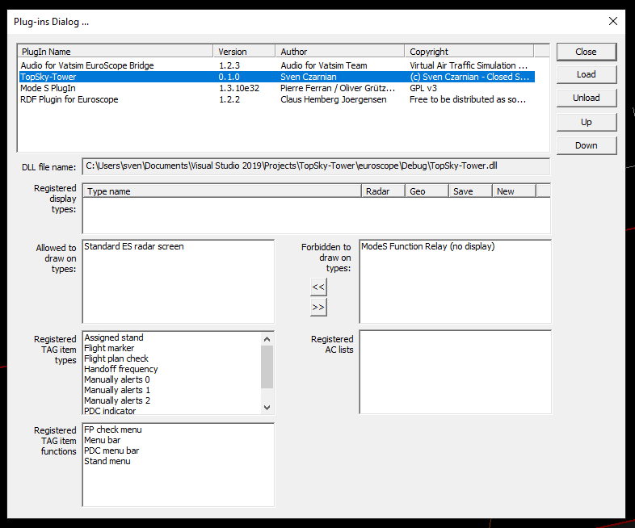

# TopSky-Tower
TopSky-Tower is a plug-in for EuroScope 3.2.1.24 and following.
The plug-in is designed to interact with TopSky, an other EuroScope plug-in.

## Table of Contents
  * [Concept](#concept)
  * [Installation](#installation)
    + [Developer installation](#developer-installation)
    + [User installation](#user-installation)
  * [Credits](#credits)

## Concept
TopSky-Tower extends the standard functionalities of EuroScope.
It is generally designed to be compatible with GRPlugin and TopSky.

More details about the Euroscope-integration is documented here: \ref euroscope

### Management systems

TopSky-Tower provides multiple management systems that are optimized to control aircrafts on the ground
during high-traffic situations.

The following management systems are integrated and are documented in the corresponding areas:
- Stand managment: \ref topskytower::management::StandControl
- PDC system: \ref topskytower::management::PdcControl
- Sector relation: \ref topskytower::management::SectorControl
- Departure sequence: \ref topskytower::management::DepartureSequenceControl
- NOTAMs: \ref topskytower::management::NotamControl

### Surveillance systems

TopSky-Tower provides multiple surveillance systems that are inspired by the real world and helps
to control that aircrafts are moving as expected and cleared by the controller.

The following surveillance systems are integrated and are documented in the corresponding areas:
- Flight plan check: \ref topskytower::surveillance::FlightPlanControl
- Radio Direction Finder: \ref topskytower::surveillance::RadioControl
- Conformance Monitoring Alerts for Controllers: \ref topskytower::surveillance::CMACControl
- Autonomous Runway Incursion Warning System: \ref topskytower::surveillance::ARIWSControl
- Short Term Collision Detection: \ref topskytower::surveillance::STCDControl
- Medium Term Collision Detection: \ref topskytower::surveillance::MTCDControl

## Setup
The setup describes two different ways of installation.
Due to the system complexity are multiple configuration files required to use all functions.
This is most relevant for the NAV-departements to setup the system for the controllers.
The user installation is for controllers who have valid configurations and want to integrate the system.

### Developer installation

A configuration documenation can be found here: \ref format
Please set up the configuration accordingly to this documentation.

### User installation

The plug-in needs to be loaded into EuroScope via the plugin-menu.

The used ASR-file needs an extension at the end of the field that TopSky-Tower identifies which airport and elevation of the airport is used.
@code{.xml}
PLUGIN:TopSky-Tower:Airport:ICAO
PLUGIN:TopSky-Tower:Elevation:FEET
PLUGIN:TopSky-Tower:HideWindows:[0/1]
@endcode

The ICAO code is the code of the controlled airport.
The elevation defines the altitude which is used to assume an aircraft on the ground.
The flag to hide windows defines if the toolbar and all automatic windows should be deactivated or not.
This flag is intended to be used if TopSky is used in the same profile.

The departure and arrival lists need to be updated.
It makes sense to integrate the following entries to the departure list:
- TopSky-Tower / Assigned stand
- TopSky-Tower / SID step climb indicator
- TopSky-Tower / Flight plan check
  - Right button: TopSky-Tower / FP check menu
- TopSky-Tower / PDC indicator
  - Right button: TopSky-Tower / PDC menu bar
- TopSky-Tower / Departure Ground status
  - Right button: TopSky-Tower / Departure Ground status menu
- TopSky-Tower / Holding point
  - Right button: TopSky-Tower / Holding point menu

The arrival list should have the following entries:
- TopSky-Tower / Assigned stand
  - Right button: TopSky-Tower / Stand menu
- TopSky-Tower / Arrival Ground status
  - Right button: TopSky-Tower / Arrival Ground status menu

The tag extension should have the following entries for the Correlated A+C mode, Correlated S mode in all three entries:
- In one single line:
  - TopSky-Tower / Surveillance alerts
   - Right button: TopSky-Tower / Surveillance visualization trigger
  - TopSky-Tower / Manually alerts 0
  - TopSky-Tower / Manually alerts 1
  - TopSky-Tower / Manually alerts 1
- Extension of the callsign:
  - Before the callsign: TopSky-Tower / Flight marker
  - Left button: TopSky-Tower / Draw departure route
  - Right button: TopSky-Tower / Menu bar
- In one single line at the bottom:
  - TopSky-Tower / Handoff frequency

The Hoppies-code needs to be stored in the 'TopSkyTowerHoppies.txt' otherwise is it not possible to use PDC.

## Credits
The plug-in uses some open-source projects or image providers.
Below is the list of the different third-party contributions with their licenses:
- The logo of the plug-in is provided by [https://www.flaticon.com/](https://www.flaticon.com/) under the [CreativeCommons-3.0](https://creativecommons.org/licenses/by/3.0/) license
- [Eigen](http://eigen.tuxfamily.org/index.php?title=Main_Page) is used for basic mathematical operations on the screen
- For fast flight management on the stand association is [nanoflann](https://github.com/jlblancoc/nanoflann) used
- [Curl](https://curl.haxx.se/) is used for the http-communication which is published under the [libcurl](https://curl.haxx.se/docs/copyright.html) license
- The geometry-subsystem of [boost](https://www.boost.org/) is used for flight to sector associations
- The [GeographicLib](https://geographiclib.sourceforge.io/) is used to perform any kind of WGS84-based calculations and coordinate system transformations
