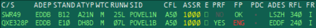

# TopSky-Tower
TopSky-Tower is a plug-in for EuroScope 3.2.1.24 and following.
The plug-in is designed to interact with TopSky, an other EuroScope plug-in.

## Table of Contents
  * [Concept](#concept)
  * [Installation](#installation)
    + [Developer installation](#developer-installation)
    + [User installation](#user-installation)
  * [Credits](#credits)

## Concept
TopSky-Tower extends the standard functionalities of EuroScope.
It provides a new menu for tags that allows marking of flights and an extended tracking- and handoff-management.
The handoff-management is also optimized for ground-to-ground handoffs and predicts the next sector of a tag.
Tracking on the ground is more usable by this technique.
Due to the prediction is most of the time no manual selection of the next sector required.

The marking-system is equal to the marking-system of TopSky.
It allows the highlighting of tags, the tagging of missed-approaches or irregular departures.

### Flight plan checks and stand management

An other system is the flight plan checking tool.
It checks the flight plan based on flight levels, the even-odd-rule, navigation capabilities and engine types.
Additionally is the definition of destination constraints possible.
This allows to deactivate some generic checks, like flight levels or even-odd-changes.

The flight plan checker shows abbreviation:
  * VFR - Defined as VFR flight
  * RTE - Invalid route with no SID exit point
  * SID - Unknown SID
  * FL - Does not match flight level constraints
  * E/O - Even-odd-rule does not fit  
  * ENG - Wrong engine type
  * NAV - Wrong navigation capabilities
  * XDR - Wrong transponder capabilities
  * UNK - Something else went wrong
  * ERR - Multiple flight plan errors detected

The checker provides a simple menu that activates an flight plan error-log reader and an overwrite-function.
The overwrite functions marks the flight plan as valid independent from error log.

If a flight plan is marked as valid or is overwritten by the controller is the initial clearance limit set
and the flight plan changed in that way that all waypoints before the SIDs exit point are deleted and the
SID with the departure runway is added to the flight plan.
The flight plan checker provides a marker if the SID contains climb constraints and the phraseology requires
the "climb via SID" call.

### Ground status

TopSky-Tower introduces the tag element "TopSky-Tower / Departure Ground status" which is supposed to replace the integrates EuroScope GroundStatus-flag.
TopSky-Tower is designed to be compatible with EuroScope, but extends or replaces existing features.
The "TopSky-Tower / Departure Ground status" flags are published to normal EuroScope users for the existing flags:
 - ST-UP
 - PUSH
 - TAXI
 - DEPA

The new flags (DEICE, LI-UP) are published via the tags to the other TopSky-Tower controllers.
This allows the most flexible combination without breaking normal EuroScope-features.

"TopSky-Tower / Arrival Ground status" is a complete new ground status field for arriving flights.
It allows the following entries:
 - APPR
 - LAND
 - TAXI
 - GO-AR

The "APPR" flag is used to mark that the initial contact by the pilot happened, but no landing clearance was given.
"LAND" marks a given landing clearance, "TAXI" indicates that the flight is taxiing on the ground and "GO-AR"
defines that the flight is going around. The "GO-AR" flag sets the M/A-flag in the manually alerts automatically.
This allows a single-click communication with TopSky for the upper airspaces.

The arrival flags are also shared with all other TopSky-Tower controllers, but is hidden for the default EuroScope-users.

### PDC communication

### Surveillance systems

### Controller menu

The controller menu is defined on top of the RADAR screen as a toolbar.
It is possible to reload single configuration files and activate or deactivate single functions or components of the system.

The Settings-menu is a drop-down menu to reload single configuration files.

A PDC-button activates or deactivates the PDC system. It is deactivated after a system start.

The ARIWS-button enables or disables ARIWS including the warnings in the flight's tags.

An other button is the LVP-button which activates or deactivates the Low-Visibility-Procedures.
The normal procedure mode is activated after a system startup. This flag is i.e. used by ARIWS to select the correct
holding points to analyise the runway incursions per aircraft.

## Setup
The setup describes two different ways of installation.
Due to the system complexity are multiple configuration files required to use all functions.
This is most relevant for the NAV-departements to setup the system for the controllers.
The user installation is for controllers who have valid configurations and want to integrate the system.

### Developer installation

A configuration documenation can be found here: \ref format
Please set up the configuration accordingly to this documentation.

### User installation

The plug-in needs to be loaded into EuroScope via the plugin-menu.

The used ASR-file needs an extension at the end of the field that TopSky-Tower identifies which airport is used.
@code{.xml}
PLUGIN:TopSky-Tower:Airport:ICAO
@endcode
The ICAO code is the code of the controlled airport.

The departure and arrival lists need to be updated.
It makes sense to integrate the following entries to the departure list:
- TopSky-Tower / Assigned stand
- TopSky-Tower / SID step climb indicator
- TopSky-Tower / Flight plan check
  - Right button: TopSky-Tower / FP check menu
- TopSky-Tower / PDC indicator
  - Right button: TopSky-Tower / PDC menu bar
- TopSky-Tower / Departure Ground status
  - Right button: TopSky-Tower / Departure Ground status menu

The arrival list should have the following entries:
- TopSky-Tower / Assigned stand
  - Right button: TopSky-Tower / Stand menu
- TopSky-Tower / Arrival Ground status
  - Right button: TopSky-Tower / Arrival Ground status menu

The tag extension should have the following entries for the Correlated A+C mode, Correlated S mode in all three entries:
- In one single line:
  - TopSky-Tower / Surveillance alerts
  - TopSky-Tower / Manually alerts 0
  - TopSky-Tower / Manually alerts 1
  - TopSky-Tower / Manually alerts 1
- Extension of the callsign:
  - Before the callsign: TopSky-Tower / Flight marker
  - Right button: TopSky-Tower / Menu bar
- In one single line at the bottom:
  - TopSky-Tower / Handoff frequency

The Hoppies-code needs to be stored in the 'TopSkyTowerHoppies.txt' otherwise is it not possible to use PDC.

## Credits
The plug-in uses some open-source projects or image providers.
Below is the list of the different third-party contributions with their licenses:
- The logo of the plug-in is provided by [https://www.flaticon.com/](https://www.flaticon.com/) under the [CreativeCommons-3.0](https://creativecommons.org/licenses/by/3.0/) license
- [Eigen](http://eigen.tuxfamily.org/index.php?title=Main_Page) is used for basic mathematical operations on the screen
- For fast flight management on the stand association is [nanoflann](https://github.com/jlblancoc/nanoflann) used
- [Curl](https://curl.haxx.se/) is used for the http-communication which is published under the [libcurl](https://curl.haxx.se/docs/copyright.html) license
- The geometry-subsystem of [boost](https://www.boost.org/) is used for flight to sector associations
- The [GeographicLib](https://geographiclib.sourceforge.io/) is used to perform any kind of WGS84-based calculations and coordinate system transformations
